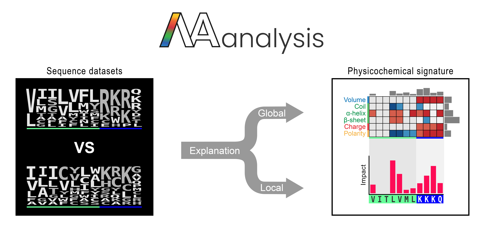
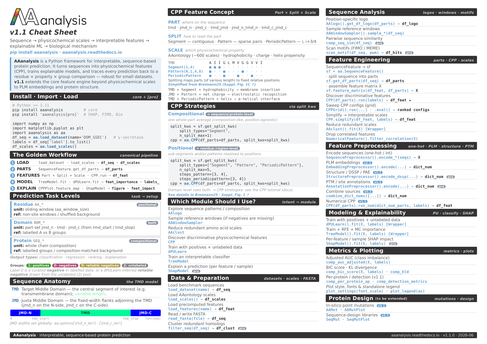

Welcome to the AAanalysis documentation!
========================================
..
    Developer Notes:
    Please make sure that badges in badges.rst (Read The Docs)
    and README.rst (GitHub) are the same.

.. =========================
.. Distribution
.. =========================

.. |License| image:: https://img.shields.io/github/license/breimanntools/aaanalysis.svg
   :target: https://github.com/breimanntools/aaanalysis/blob/master/LICENSE
   :alt: License

.. |PyPI Version| image:: https://img.shields.io/pypi/v/aaanalysis.svg
   :target: https://pypi.org/project/aaanalysis/
   :alt: PyPI - Package Version

.. |Supported Python Versions| image:: https://img.shields.io/pypi/pyversions/aaanalysis.svg
   :target: https://pypi.org/project/aaanalysis/
   :alt: Supported Python Versions

.. |Downloads| image:: https://pepy.tech/badge/aaanalysis
   :target: https://pepy.tech/project/aaanalysis
   :alt: Downloads

.. |GitHub Stars| image:: https://img.shields.io/github/stars/breimanntools/aaanalysis.svg?style=social
   :target: https://github.com/breimanntools/aaanalysis
   :alt: GitHub Stars

.. =========================
.. Status
.. =========================

.. |PyPI Status| image:: https://img.shields.io/pypi/status/aaanalysis.svg
   :target: https://pypi.org/project/aaanalysis/
   :alt: PyPI - Status

.. |Unit Tests| image:: https://github.com/breimanntools/aaanalysis/actions/workflows/main.yml/badge.svg
   :target: https://github.com/breimanntools/aaanalysis/actions/workflows/main.yml
   :alt: CI/CD Pipeline

.. |Codecov| image:: https://codecov.io/gh/breimanntools/aaanalysis/branch/master/graph/badge.svg
   :target: https://codecov.io/gh/breimanntools/aaanalysis
   :alt: Codecov

.. |CodeQL| image:: https://github.com/breimanntools/aaanalysis/actions/workflows/codeql_analysis.yml/badge.svg
   :target: https://github.com/breimanntools/aaanalysis/actions/workflows/codeql_analysis.yml
   :alt: CodeQL

.. =========================
.. Table
.. =========================

.. list-table::
   :widths: 15 85
   :header-rows: 1

   * - **Distribution**
     - |License| |PyPI Version| |Supported Python Versions| |Downloads|
   * - **Status**
     - |PyPI Status| |Unit Tests| |Codecov| |CodeQL| |GitHub Stars|

**AAanalysis** (Amino Acid analysis) is a Python framework for interpretable sequence-based protein prediction.
Its foundation are the following algorithms:

- **CPP**: Comparative Physicochemical Profiling, a feature engineering algorithm comparing two sets of protein
  sequences to identify the set of most distinctive features.
- **dPULearn**: deterministic Positive-Unlabeled (PU) Learning algorithm to enable training on
  unbalanced and small datasets.
- **AAclust**: k-optimized clustering wrapper framework to select redundancy-reduced sets of numerical scales
  (e.g., amino acid scales).

In addition, AAanalysis provide functions for loading various protein benchmark datasets, amino acid scales,
and their two-level classification (**AAontology**). We combined **CPP** with the explainable
AI  `SHAP <https://shap.readthedocs.io/en/latest/index.html>`_ framework to explain sample level predictions with
single-residue resolution.

If you are looking to make publication-ready plots with a view lines of code, see our
`Plotting Prelude <https://aaanalysis.readthedocs.io/en/latest/generated/plotting_prelude.html>`_.

You can find the official documentation at `Read the Docs <https://aaanalysis.readthedocs.io/en/latest/>`_.

Install
=======
**AAanalysis** can be installed from `PyPi <https://pypi.org/project/aaanalysis>`_:

.. code-block:: bash

   pip install aaanalysis

For extended features, including the explainable AI module:

.. code-block:: bash

    pip install "aaanalysis[pro]"

If you use uv, the equivalent commands are:

.. code-block:: bash

    uv pip install aaanalysis
    uv pip install "aaanalysis[pro]"

Contributing
============
We appreciate bug reports, feature requests, or updates on documentation and code. For details, please refer to
`Contributing Guidelines <CONTRIBUTING.rst>`_. These cover AAanalysis development conventions and the automated
quality gates every change must pass. For further questions or suggestions, please email stephanbreimann@gmail.com.

Cheat Sheet
===========
The cheat sheet distills AAanalysis into a three-page summary: the golden workflow, the main
classes grouped by capability, the prediction levels (residue / domain / protein), and the
*Part × Split × Scale* feature ontology. Click the image below to download the PDF.

The AAanalysis Ecosystem
========================
AAanalysis is the interpretable middle layer between bioinformatics I/O and the downstream machine
learning, explainable AI, and protein-design stack. It *consumes* upstream representations (sequences,
embeddings, structures) and even competitor descriptor sets, and runs them through its interpretable
core (*Part × Split × Scale* · AAontology · CPP). Downstream machine-learning and explainable-AI
methods then either *consume* these features directly or are *integrated* into AAanalysis through
wrappers or native implementations — for example SHAP via ``ShapModel``, or machine-learning models
such as random forests via ``TreeModel`` — so the resulting features, explanations, and design
objectives feed straight into the standard ML / XAI / optimization tools.

Click the diagram to view and download the full map, or open the
`ecosystem positioning page <https://aaanalysis.readthedocs.io/en/latest/_static/aaanalysis_ecosystem.html>`_
— a self-contained walkthrough with the map, its introduction, and further background.

.. image:: https://raw.githubusercontent.com/breimanntools/aaanalysis/master/docs/source/_artwork/diagrams/aaanalysis_ecosystem.png
   :alt: The AAanalysis ecosystem — where AAanalysis fits in the protein-ML stack
   :target: https://raw.githubusercontent.com/breimanntools/aaanalysis/master/docs/source/_artwork/diagrams/aaanalysis_ecosystem.svg
   :width: 100%
   :align: center

Citations
=========
If you use AAanalysis in your work, please cite the respective publication as follows:

**AAclust**:
   Breimann and Frishman (2024a),
   *AAclust: k-optimized clustering for selecting redundancy-reduced sets of amino acid scales*,
   `Bioinformatics Advances <https://academic.oup.com/bioinformaticsadvances/article/4/1/vbae165/7852846>`__.

**AAontology**:
   Breimann *et al.* (2024b),
   *AAontology: An ontology of amino acid scales for interpretable machine learning*,
   `Journal of Molecular Biology <https://www.sciencedirect.com/science/article/pii/S0022283624003267>`__.

**CPP**:
   Breimann and Kamp *et al.* (2025),
   *Charting γ-secretase substrates by explainable AI*,
   `Nature Communications <https://www.nature.com/articles/s41467-025-60638-z>`__.

**dPULearn**:
   Breimann and Kamp *et al.* (2025),
   *Charting γ-secretase substrates by explainable AI*,
   `Nature Communications <https://www.nature.com/articles/s41467-025-60638-z>`__.
