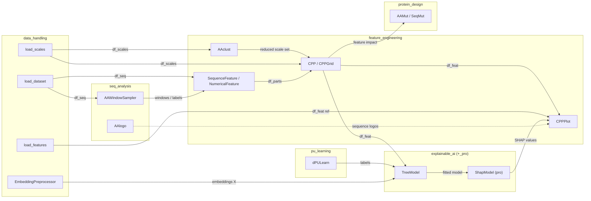

# AAanalysis module map (internal dataflow)

How the public subpackages **connect at runtime** — the canonical pipeline
`load → parts → CPP → model → explain → plot`. This is a **dataflow/composition**
map, **not an import graph**: the frontends are deliberately decoupled (only a
handful of cross-subpackage imports; everything shares the `aaanalysis.utils`
barrel and backend isolation is test-gated), so the connections below happen in
**user code passing DataFrames**, not in module imports.

Scope: this is the *internal* mental model. The *external* ecosystem (AAanalysis ↔
sklearn / SHAP / biopython / upstream descriptors) is a separate diagram
(README + Introduction, issue #210). A user-facing rendered version of this map is
owned by the docs-architecture epic **#106**; this file is the GitHub/agent source.

**Cross-cutting (used by many, not a pipeline stage):** `plotting`
(`plot_settings`/colors/`plot_legend`/`plot_rank`) styles every `*Plot`; `metrics`
(`comp_*`) scores model/clustering outputs.

**Pro / utility subpackages (off the core flow):** `data_handling_pro`
(StructurePreprocessor, AnnotationPreprocessor), `seq_analysis_pro`
(comp_seq_sim, filter_seq, scan_motif), `explainable_ai_pro` (ShapModel),
`show_html` (display_df, dev).

<!-- MAP-SUBPKGS:START — roster checked by check_module_map.py; regenerate with --write-roster -->
- data_handling
- data_handling_pro
- explainable_ai
- explainable_ai_pro
- feature_engineering
- metrics
- plotting
- protein_design
- pu_learning
- seq_analysis
- seq_analysis_pro
- show_html
<!-- MAP-SUBPKGS:END -->

_Validated by `agent-readiness-audit` (`scripts/check_module_map.py`): every public
subpackage must appear above; the diagram/prose is curated by hand (semantic
dataflow can't be auto-derived)._
