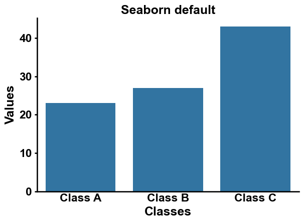
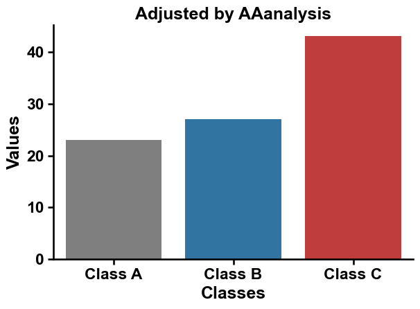

Plotting Prelude
================

These are some of our utility plotting functions to make
publication-ready visualizations with a view extra lines of code.

Let us first make all imports and create some data

.. code:: ipython2

    import matplotlib.pyplot as plt
    import seaborn as sns
    
    data = {'Classes': ['Class A', 'Class B', 'Class C'], 'Values': [23, 27, 43]}

The default seaborn output with removed top and right spines looks like
this:

.. code:: ipython2

    sns.barplot(x='Classes', y='Values', data=data)
    sns.despine()
    plt.title("Seaborn default")
    plt.tight_layout()
    plt.show()

Just call our ``aa.plot_setting`` function with our optimized color set
to get this:

.. code:: ipython2

    import aaanalysis as aa
    
    colors = aa.plot_get_clist()
    aa.plot_settings()
    sns.barplot(x='Classes', y='Values', data=data, hue="Classes", palette=colors)
    sns.despine()
    plt.title("Adjusted by AAanalysis")
    plt.tight_layout()
    plt.show()

The settings can be easily adjusted. Use our customized sets of 2 to 9
colors for an appealing comparison of categorical data via
``aa.plot_get_clist``:

.. code:: ipython2

    data = {'Classes': ['Class A', 'Class B', 'Class C', "Class D", "Class E"], 'Values': [23, 27, 43, 9, 14]}
    
    colors = aa.plot_get_clist(n_colors=5)
    aa.plot_settings(no_ticks_x=True, short_ticks_y=True, grid=True, grid_axis="y")
    
    sns.barplot(x='Classes', y='Values', hue="Classes", data=data, palette=colors)
    sns.despine()
    plt.title("Adjusted by AAanalysis (grid, no x ticks)")
    plt.tight_layout()
    plt.show()

.. image:: plotting_prelude_3_output_7_0.png

You can easily increase the fontsize of the labels in matching to the
other elements and create an independent legend like this:

.. code:: ipython2

    data = {'Classes': ['Class A', 'Class B', 'Class C', "Class D", "Class E"], 'Values': [23, 27, 43, 9, 14]}
    colors = aa.plot_get_clist(n_colors=5)
    aa.plot_settings(no_ticks_x=True, short_ticks_y=True)
    ax = sns.barplot(x='Classes', y='Values', hue="Classes", data=data, palette=colors)
    # Set different hatches for each bar
    hatches = ["/", "/", "/", ".", "."]
    for bar, hatch in zip(ax.patches, hatches):
        bar.set_hatch(hatch)
    sns.despine()
    
    fontsize = aa.plot_gcfs()
    plt.title("Adjusted by AAanalysis (hatches, smaller title)", size=fontsize-2)
    
    dict_color = {"Group 1": "black", "Group 2": "black"}
    aa.plot_legend(dict_color=dict_color, ncol=1, x=0.7, y=0.9, hatch=["/", "."])
    plt.tight_layout()
    plt.show()

.. image:: plotting_prelude_4_output_9_0.png

