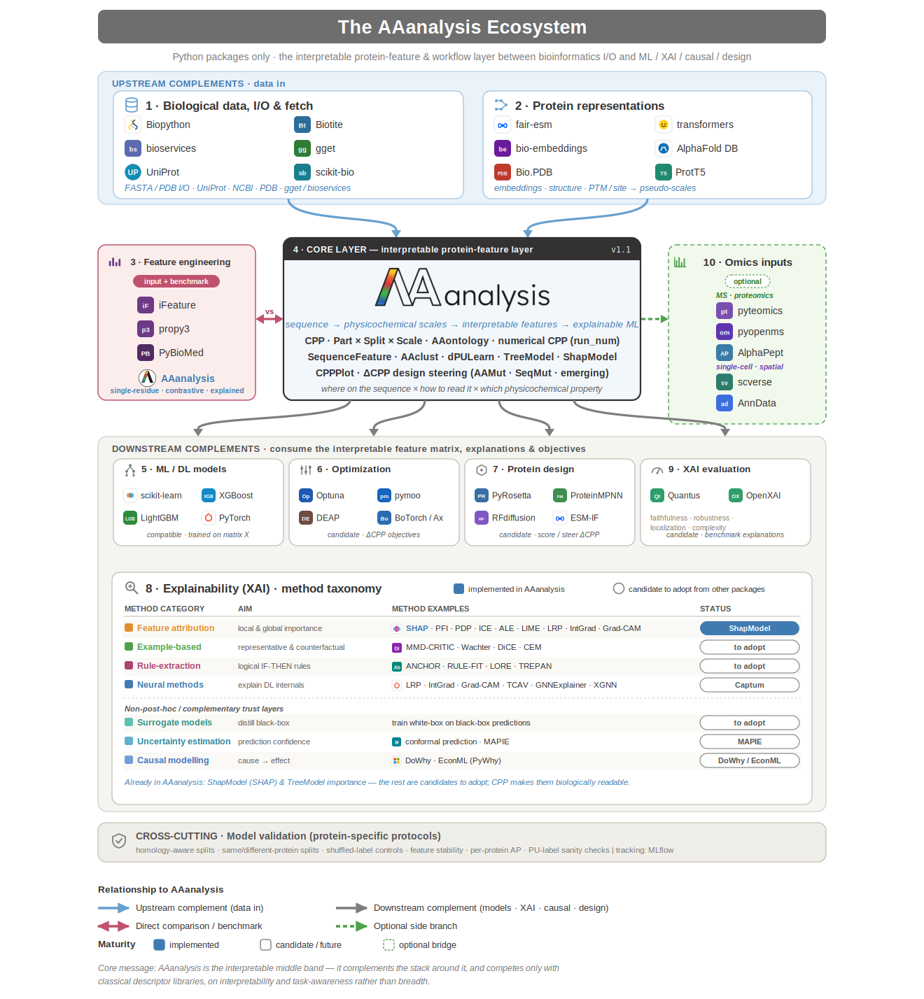

..
   Developer Notes:
   This is the landing page for the AAanalysis documentation using Sphinx, containing the root `toctree` directive.
   The documentation will be hosted on Read the docs.
..

Welcome to the AAanalysis documentation!
========================================
.. include:: index/badges.rst
.. include:: index/overview.rst

Install
=======
**AAanalysis** can be installed from `PyPi <https://pypi.org/project/aaanalysis>`_:

.. code-block:: bash

   pip install aaanalysis

For extended features, including our explainable AI module, please use the 'professional' version:

.. code-block:: bash

   pip install aaanalysis[pro]

Cheat Sheet
===========
The cheat sheet distills AAanalysis into a three-page summary: the golden workflow, the main
classes grouped by capability, the prediction levels (residue / domain / protein), and the
*Part × Split × Scale* feature ontology.

.. raw:: html

   

     Click the image to open the interactive cheat sheet in your browser or
     <a href="_static/cheat_sheet.pdf" download="AAanalysis_cheat_sheet.pdf">click here to download the PDF cheat sheet</a>.
   

   

.. toctree::
   :maxdepth: 1
   :hidden:
   :caption: OVERVIEW

   index/introduction.rst
   index/CONTRIBUTING_COPY.rst
   index/docstring_guide.rst
   index/usage_principles.rst
   index/evaluation.rst

.. toctree::
   :maxdepth: 1
   :hidden:
   :caption: EXAMPLES

   tutorials.rst
   protocols.rst

.. toctree::
   :maxdepth: 2
   :hidden:
   :caption: REFERENCES

   api.rst

.. toctree::
   :maxdepth: 1
   :hidden:

   index/tables.rst
   index/glossary.rst
   index/references.rst
   index/release_notes.rst

Indices and tables
==================

* :ref:`genindex`
* :ref:`modindex`
* :ref:`search`

The AAanalysis Ecosystem
========================
AAanalysis is the interpretable middle layer between bioinformatics I/O and the downstream machine
learning, explainable AI, and protein-design stack. It *consumes* upstream representations (sequences,
embeddings, structures) and even competitor descriptor sets, runs them through its interpretable core
(*Part × Split × Scale* · AAontology · CPP · ShapModel), and *exposes* the resulting features,
explanations, and objectives to the standard ML / XAI / optimization tools.

Explore the full `interactive ecosystem map <_static/aaanalysis_ecosystem.html>`_ — per-category
packages, the comparison matrix, and where AAanalysis sits in the protein-ML stack. Click the diagram
to open it.

Citation
========

.. include:: index/citations.rst
